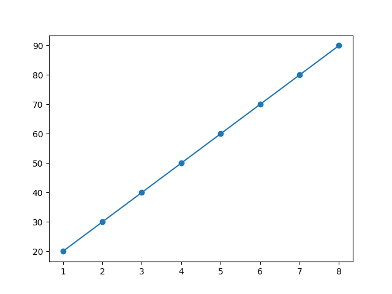

# Student Marks Prediction

This project uses Linear Regression to predict student marks based on study hours.

## Technologies Used
- Python
- Pandas
- Matplotlib
- Scikit-learn

## How to Run
1. Install libraries:
   pip install pandas matplotlib scikit-learn

2. Run:
   python project.py

## Output
Graph showing relationship between study hours and marks.
## Output Graph

